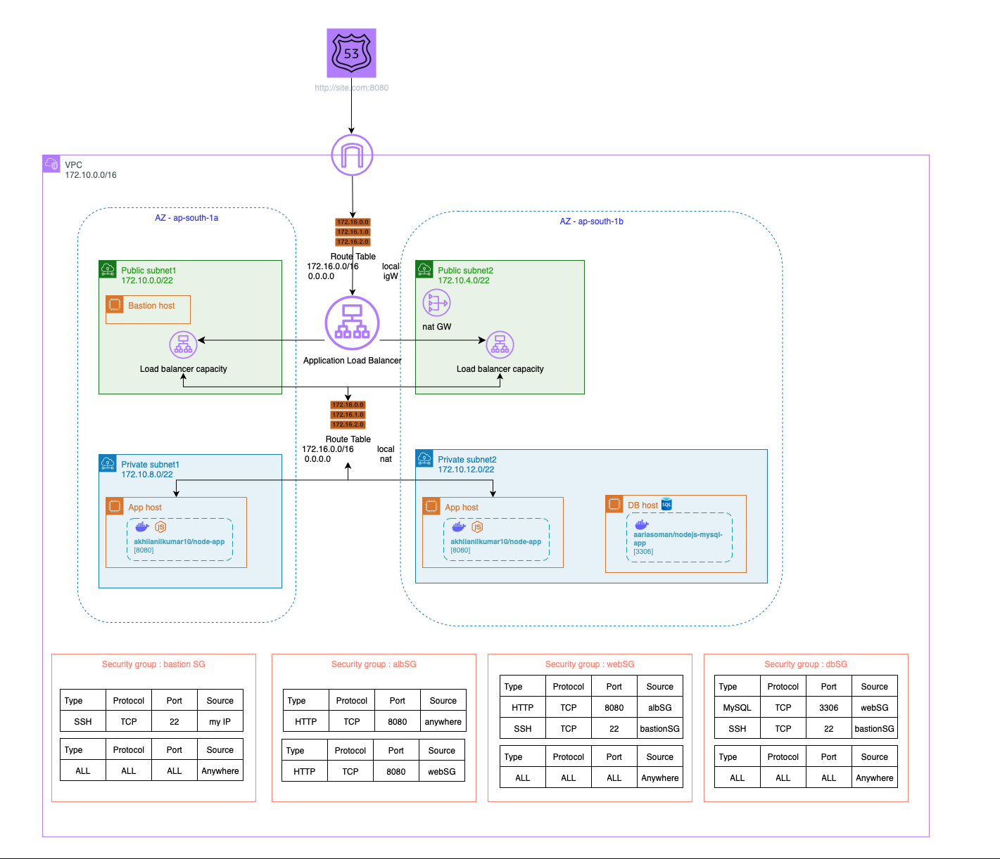

# NodeJs Application with Terraform and AWS

## Overview
This repository contains AWS infrastructure setup script using Terraform. The script provisions a Virtual Private Cloud (VPC) with public and private subnets, security groups, NAT and Internet Gateways, EC2 instances, and an Application Load Balancer (ALB) to host a nodeJS website with MySQL database and stores statefiles in S3 bucket.

## Architecture


The infrastructure setup includes:
- **VPC**: Created in the `ap-south-1` region.
- **Subnets**:
  - 2 Public Subnets
  - 2 Private Subnets (distributed across `ap-south-1a` and `ap-south-1b`)
- **Networking Components**:
  - Internet Gateway for public subnet access
  - NAT Gateway for outbound traffic from private subnets
  - Route tables for public and private subnets
- **Security Groups**: Configured for the bastion host, web servers, db servers and ALB.
- **EC2 Instances**:
  -  **bastion host** in a public subnet
  - **Two EC2 instances** in private subnets running nodeJS application inside docker containers.
  - **One EC2 instance** in private subnets running Databse inside docker containers.
- **Load Balancer**: An ALB to distribute traffic to the private EC2 instances
- **Docker images uses**:
  - **NodeJS Application** - [akhilanilkumar10/node-app](https://hub.docker.com/repository/docker/akhilanilkumar10/node-app/general)
  - **Database Application** - [akhilanilkumar10/db-image](https://hub.docker.com/repository/docker/akhilanilkumar10/db-image/general)


## File Structure
```
node-terraform-app/
├── datasource.tf
├── db_userdata.sh
├── img
│   └── arch.jpg
├── main.tf
├── node_app_userdata.sh
├── output.tf
├── provider.tf
├── README.md
├── sec_group.tf
├── terraform.tfvars
├── backend.tf
├── variables.tf
└── vpc_infra.tf
```
 - **vpc_infra.tf :**    this terraform script creates VPC, Subnets, Route tables, Internet Gateway, NAT Gateway, Security Groups
 - **main.tf :**      this script creates EC2 instances,ALB and Route53 records
 - **sec_group.tf :**       this script creates Security groups
 - **backend.tf**   s3 bucket details to store statefile
 - **db_userdata.sh**   userdata script for db host
 - **node_app_userdata.sh**   userdata script for node application hosts
 
## Requirements
- AWS , Terraform 
- IAM user with permissions to create and manage AWS resources or mention AWS secret key and access key (only use while testing locally)

## Steps to Run

- To create infrastructure
```
terraform init
terraform validate
terraform plan
terraform apply --auto-approve
```
- To delete infrastrcuture

```
terraform destroy --auto-approve
```

## Notes
- Ensure that the SSH key pair for the bastion host is properly configured to allow secure access.
